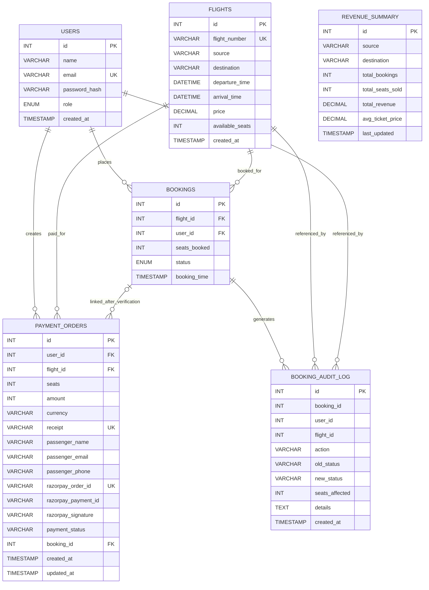

# Udan Khatola

Udan Khatola is a full-stack flight booking system built with React, TypeScript, Vite, Express, and MySQL. It combines a passenger-facing booking experience, an admin operations dashboard, JWT-based authentication, Razorpay payment integration, email confirmations, and database-side analytics/business logic implemented with indexes, triggers, and stored procedures.

## What The Project Does

The project lets users:

- browse available flights
- search flights by source, destination, and maximum price
- sign up and log in
- book seats through a Razorpay-backed checkout flow
- view personal booking history
- mark bookings as completed
- cancel eligible bookings
- see personal travel analytics

The project lets admins:

- access a protected admin dashboard
- add new flights
- view the current flight inventory
- see route-level revenue analytics
- inspect booking audit logs generated by triggers
- apply bulk price updates through a stored procedure
- inspect active database indexes

The backend also:

- decreases `available_seats` when a booking is confirmed
- restores seats when a booking is cancelled through the cancellation procedure plus trigger flow
- stores payment order metadata for Razorpay orders
- sends booking confirmation emails using Nodemailer
- seeds dummy flights on startup

## Tech Stack

### Frontend

- React 19
- TypeScript
- Vite
- React Router
- Tailwind CSS
- Base UI tabs/select primitives
- shadcn-style UI components
- Lucide React icons

### Backend

- Node.js
- Express
- mysql2
- bcrypt
- jsonwebtoken
- dotenv
- cors
- nodemailer

### Database

- MySQL
- SQL schema scripts
- indexes
- triggers
- stored procedures with cursors

## Project Structure

```text
Udan-Khatola/
|-- backend/
|   |-- db/
|   |   |-- connection.js
|   |   |-- migration.sql
|   |   `-- setup.sql
|   |-- .env.example
|   `-- server.js
|-- frontend/
|   |-- src/
|   |   |-- components/
|   |   |-- lib/
|   |   |-- pages/
|   |   |-- App.tsx
|   |   |-- index.css
|   |   `-- main.tsx
|-- schema.sql
`-- README.md
```

## Frontend Features

### 1. Home Page Flight Discovery

Implemented in [App.tsx](/C:/Users/boy65/OneDrive/Documents/Dbs_project/1/Udan-Khatola/frontend/src/App.tsx).

Features on the landing page:

- cinematic aviation-themed UI with a fixed hero background
- staggered menu navigation
- live flight fetch on page load from `GET /api/flights`
- search fields for origin and destination
- airport-code-to-city mapping for common codes like `DEL`, `BOM`, `BLR`, and `MAA`
- date-of-journey picker UI
- passenger-count selector UI
- maximum-price slider
- flight search button that builds a query using `source`, `destination`, and `maxPrice`
- live flight cards showing:
  - flight number
  - source
  - destination
  - price
  - available seats
- booking CTA that:
  - redirects unauthenticated users to `/login`
  - sends authenticated users to `/book/:flightId`

Notes:

- The date picker and passenger selector are present in the UI.
- The current backend filtering logic actively uses source, destination, and max price.

### 2. Login and Signup

Implemented in [login.tsx](/C:/Users/boy65/OneDrive/Documents/Dbs_project/1/Udan-Khatola/frontend/src/pages/login.tsx).

Features:

- combined authentication screen for login and signup
- separate top-level modes for `login` and `sign up`
- nested role view for login:
  - passenger login
  - admin login
- dynamic card title and descriptive text that reflects the currently selected auth mode
- signup form fields:
  - full name
  - email
  - password
  - confirm password
- login form fields:
  - email
  - password
- automatic login after successful signup
- JWT token storage in localStorage
- profile/email/name storage in localStorage
- role-aware redirect after login:
  - `ADMIN` users go to `/admin`
  - normal users go to `/`

### 3. Booking / Payment Page

Implemented in [booking.tsx](/C:/Users/boy65/OneDrive/Documents/Dbs_project/1/Udan-Khatola/frontend/src/pages/booking.tsx).

Features:

- protected booking page per flight
- fetches:
  - flight details from `GET /api/flights/:id`
  - payment config from `GET /api/payment/config`
- shows:
  - route
  - departure time
  - arrival time
  - fare per seat
  - live inventory / available seats
  - total payable amount
- traveler detail capture:
  - passenger name
  - passenger email
  - passenger phone
  - seat count selector
- seat selector is capped by the available seats and limited to a small list for UX
- loads Razorpay checkout script dynamically
- creates a payment order through backend
- opens Razorpay Checkout
- verifies payment signature through backend
- navigates to `/bookings` on successful payment verification
- shows gateway readiness message based on whether Razorpay keys are configured

### 4. My Bookings Page

Implemented in [bookings.tsx](/C:/Users/boy65/OneDrive/Documents/Dbs_project/1/Udan-Khatola/frontend/src/pages/bookings.tsx).

Features:

- fetches personal booking analytics from `GET /api/analytics/user-summary`
- fetches booking history from `GET /api/bookings`
- displays personal summary cards such as:
  - total spent
  - flights taken
- splits bookings into:
  - upcoming journeys
  - past journeys
- shows booking information like:
  - booking reference
  - route
  - departure-related info
  - status
- allows users to:
  - mark a booking complete
  - cancel a booking
  - view a boarding pass button placeholder

### 5. Admin Dashboard

Implemented in [admin.tsx](/C:/Users/boy65/OneDrive/Documents/Dbs_project/1/Udan-Khatola/frontend/src/pages/admin.tsx).

Features:

- frontend admin-role guard based on decoded JWT
- protected fetches to admin endpoints with bearer token headers
- tabbed admin interface with:
  - Flights
  - Revenue
  - Audit Log
  - Bulk Price
  - DB Indexes
- responsive wrapping tab bar layout
- inline error banner when admin API calls fail

#### Flights Tab

- add-new-flight form
- fields:
  - flight number
  - source
  - destination
  - departure datetime
  - arrival datetime
  - price
  - available seats
- posts to `POST /api/admin/flights`
- current flight inventory table from `GET /api/admin/flights`
- table shows:
  - flight number
  - route
  - departure
  - arrival
  - price
  - seat count

#### Revenue Tab

- route revenue analysis table from `GET /api/analytics/revenue`
- shows:
  - route
  - total bookings
  - seats sold
  - average ticket price
  - total revenue

#### Audit Log Tab

- trigger-generated audit log viewer from `GET /api/admin/audit-log`
- includes:
  - time
  - action
  - details
  - seats affected
  - old/new statuses

#### Bulk Price Tab

- accepts:
  - source
  - destination
  - percentage change
- calls `POST /api/admin/bulk-price-update`
- refreshes revenue and flight inventory after successful update

#### DB Indexes Tab

- reads active indexes from `GET /api/admin/indexes`
- displays index metadata for `flights`, `bookings`, and `payment_orders`

### 6. Shared Auth Utilities

Implemented in [auth.ts](/C:/Users/boy65/OneDrive/Documents/Dbs_project/1/Udan-Khatola/frontend/src/lib/auth.ts).

Features:

- token retrieval from localStorage
- JWT payload parsing on the client
- helper to get current auth user
- token storage
- profile storage
- logout and auth cleanup helper

### 7. Auth Status Component

Implemented in [AuthStatus.tsx](/C:/Users/boy65/OneDrive/Documents/Dbs_project/1/Udan-Khatola/frontend/src/components/AuthStatus.tsx).

Features:

- shows current signed-in user status
- shows admin vs user icon
- logout action
- login button fallback when unauthenticated

## Backend Features

Implemented mainly in [server.js](/C:/Users/boy65/OneDrive/Documents/Dbs_project/1/Udan-Khatola/backend/server.js).

### 1. Environment-Driven Configuration

The backend reads configuration from `.env`:

- `DB_HOST`
- `DB_PORT`
- `DB_USER`
- `DB_PASSWORD`
- `DB_NAME`
- `PORT`
- `APP_ORIGIN`
- `JWT_SECRET`
- `RAZORPAY_KEY_ID`
- `RAZORPAY_KEY_SECRET`
- `RAZORPAY_COMPANY_NAME`

Example file is provided in [backend/.env.example](/C:/Users/boy65/OneDrive/Documents/Dbs_project/1/Udan-Khatola/backend/.env.example).

### 2. CORS and JSON API

- CORS is enabled for the configured frontend origin
- JSON request bodies are parsed with `express.json()`

### 3. Authentication Middleware

The backend includes:

- `requireAuth`
  - verifies bearer token
  - decodes JWT
  - exposes `req.user`
- `requireAdmin`
  - chains `requireAuth`
  - blocks non-admin users with `403`

### 4. Password Security

- user passwords are hashed with bcrypt during signup
- login compares plaintext password against stored bcrypt hash

### 5. JWT Login Sessions

- login issues a JWT containing:
  - `userId`
  - `role`
- token expiration is set to `1h`

### 6. Nodemailer Confirmation Emails

- backend creates a Nodemailer test account at startup
- booking confirmation email is sent after successful booking confirmation
- email includes:
  - user name
  - flight number
  - route
  - departure time
  - seat count

### 7. Razorpay Payment Integration

Backend payment flow includes:

- `GET /api/payment/config`
  - tells frontend whether Razorpay is configured
  - returns key id and company name
- `POST /api/payments/create-order`
  - validates passenger details
  - validates flight existence
  - checks seat availability
  - calculates order amount
  - creates a Razorpay order
  - stores a `payment_orders` row
- `POST /api/payments/verify`
  - verifies signature using HMAC SHA-256
  - prevents duplicate re-verification by checking existing `booking_id`
  - converts verified payment into a confirmed booking
  - updates `payment_orders`
  - sends confirmation email

### 8. Flight Search and Retrieval

- `GET /api/flights`
  - returns only flights with `available_seats > 0`
  - supports filters:
    - `source`
    - `destination`
    - `maxPrice`
  - sorts by `departure_time ASC`
- `GET /api/flights/:id`
  - returns single flight details

### 9. Flight Inventory Seeding

At startup the backend:

- ensures the `payment_orders` table exists
- seeds a predefined set of sample flights using `seedFlights()`

The seed set includes routes such as:

- Delhi to Mumbai
- Mumbai to Bangalore
- Delhi to Chennai
- Bangalore to Delhi
- Chennai to Mumbai
- Pune to Delhi
- Hyderabad to Kolkata
- Ahmedabad to Bangalore
- Kolkata to Goa
- Mumbai to Jaipur
- Delhi to Goa
- Chennai to Hyderabad

### 10. Booking Lifecycle

#### Legacy Direct Booking

- `POST /api/book`
- creates a booking without Razorpay
- still uses the same transactional seat deduction logic

#### Transactional Booking Logic

Implemented through `createBookingTransaction()`:

- starts a DB transaction
- decrements `available_seats` only when enough seats exist
- inserts a `bookings` row
- commits or rolls back atomically

This means:

- seats go down after a successful confirmed booking
- overbooking is prevented by the guarded update query

### 11. User Booking APIs

- `GET /api/bookings`
  - returns a user’s booking history joined with flight data
- `PUT /api/bookings/:id/complete`
  - marks a user’s booking as `COMPLETED`
- `PUT /api/bookings/:id/cancel`
  - calls the cancellation stored procedure

### 12. Analytics APIs

- `GET /api/analytics/revenue`
  - runs `sp_revenue_report()`
- `GET /api/analytics/user-summary`
  - runs `sp_user_booking_summary(?)`
  - returns overall summary plus route frequency

### 13. Admin APIs

- `GET /api/admin/flights`
  - returns all flights for admin inventory view
- `POST /api/admin/flights`
  - validates new flight payload
  - enforces positive price
  - enforces positive integer seat count
  - enforces different source and destination
  - ensures arrival is after departure
  - rejects duplicate flight numbers
- `POST /api/admin/bulk-price-update`
  - executes route-based bulk pricing procedure
- `GET /api/admin/audit-log`
  - returns recent booking audit entries
- `GET /api/admin/indexes`
  - returns metadata about indexes in the database

## Database Features

### 1. Core Tables

Defined in [backend/db/setup.sql](/C:/Users/boy65/OneDrive/Documents/Dbs_project/1/Udan-Khatola/backend/db/setup.sql) and mirrored by [schema.sql](/C:/Users/boy65/OneDrive/Documents/Dbs_project/1/Udan-Khatola/schema.sql).

Core tables:

- `users`
- `flights`
- `bookings`
- `payment_orders`

Additional migration-managed tables:

- `booking_audit_log`
- `revenue_summary`

### 2. Users Table

Stores:

- `name`
- `email`
- `password_hash`
- `role`
- `created_at`

Roles:

- `USER`
- `ADMIN`

### 3. Flights Table

Stores:

- `flight_number`
- `source`
- `destination`
- `departure_time`
- `arrival_time`
- `price`
- `available_seats`
- `created_at`

### 4. Bookings Table

Stores:

- `flight_id`
- `user_id`
- `seats_booked`
- `status`
- `booking_time`

Statuses:

- `CONFIRMED`
- `COMPLETED`
- `CANCELLED`

### 5. Payment Orders Table

Tracks:

- user id
- flight id
- seats
- amount
- currency
- receipt
- passenger name/email/phone
- Razorpay order id
- Razorpay payment id
- Razorpay signature
- payment status
- linked booking id

### 6. Indexes

Defined in [migration.sql](/C:/Users/boy65/OneDrive/Documents/Dbs_project/1/Udan-Khatola/backend/db/migration.sql).

The migration creates indexes for:

- `flights(source, destination)`
- `flights(price)`
- `flights(departure_time)`
- `bookings(status)`
- `bookings(booking_time)`

These support:

- route search
- price filtering
- departure sorting and range scans
- booking status filters
- booking history ordering

### 7. Triggers

The project uses database triggers for booking side effects.

#### `trg_after_booking_insert`

- fires after a booking insert
- writes a `BOOKING_CREATED` entry to `booking_audit_log`

#### `trg_after_booking_update`

- logs every booking status transition
- if booking becomes `CANCELLED`, restores seats to the related flight

#### `trg_before_flight_delete`

- blocks deletion of flights that still have active confirmed bookings

### 8. Stored Procedures With Cursor Logic

#### `sp_revenue_report()`

- iterates over distinct routes using a cursor
- computes:
  - total bookings
  - total seats sold
  - total revenue
  - average ticket price
- stores results in `revenue_summary`
- returns revenue summary ordered by total revenue

#### `sp_user_booking_summary(p_user_id)`

- iterates over a user’s bookings with a cursor
- computes:
  - total bookings
  - confirmed count
  - completed count
  - cancelled count
  - total spent
  - average spend per booking
- also builds a temporary per-route frequency table
- returns:
  - summary row
  - route frequency breakdown

#### `sp_cancel_booking(p_booking_id)`

- validates booking existence
- prevents duplicate cancellation
- prevents cancellation of completed bookings
- updates status to `CANCELLED`
- relies on the update trigger to:
  - log the action
  - restore seats

#### `sp_bulk_price_update(p_source, p_destination, p_percentage)`

- iterates through flights on a route with a cursor
- recalculates price using the supplied percentage
- floors negative values to zero
- returns:
  - summary of update count
  - per-flight old/new pricing details

## Routes

Frontend routes defined in [main.tsx](/C:/Users/boy65/OneDrive/Documents/Dbs_project/1/Udan-Khatola/frontend/src/main.tsx):

- `/` -> home/search page
- `/book/:flightId` -> booking plus payment page
- `/bookings` -> personal bookings page
- `/login` -> auth page
- `/admin` -> admin dashboard

## API Summary

### Public-ish / General

- `GET /api/flights`
- `GET /api/flights/:id`
- `POST /api/auth/signup`
- `POST /api/auth/login`

### Authenticated User

- `GET /api/payment/config`
- `POST /api/payments/create-order`
- `POST /api/payments/verify`
- `POST /api/book`
- `GET /api/bookings`
- `PUT /api/bookings/:id/complete`
- `PUT /api/bookings/:id/cancel`
- `GET /api/analytics/user-summary`

### Admin

- `GET /api/admin/flights`
- `POST /api/admin/flights`
- `POST /api/admin/bulk-price-update`
- `GET /api/admin/audit-log`
- `GET /api/admin/indexes`

### Analytics

- `GET /api/analytics/revenue`

## Seat Availability Behavior

This project does actively manage seat inventory.

- successful booking confirmation reduces `flights.available_seats`
- cancellation restores seats through stored-procedure plus trigger logic
- the user booking page shows live inventory for the selected flight
- the home page flight cards show available seats
- the admin inventory table shows available seats for every flight
- general flight search excludes flights with zero available seats

## Setup Instructions

### 1. Install Dependencies

From the project root, install frontend and backend dependencies as needed.

#### Backend

```powershell
cd backend
npm install
```

#### Frontend

```powershell
cd frontend
npm install
```

### 2. Configure Environment Variables

Create `backend/.env` using [backend/.env.example](/C:/Users/boy65/OneDrive/Documents/Dbs_project/1/Udan-Khatola/backend/.env.example).

Typical values:

```env
DB_HOST=localhost
DB_PORT=3306
DB_USER=root
DB_PASSWORD=mysql_pass_123
DB_NAME=flight_db
PORT=3000
APP_ORIGIN=http://localhost:5173
JWT_SECRET=mysecret123
RAZORPAY_KEY_ID=your_test_or_live_key
RAZORPAY_KEY_SECRET=your_test_or_live_secret
RAZORPAY_COMPANY_NAME=Udan Khatola
```

### 3. Create Database Objects

Run:

1. [backend/db/setup.sql](/C:/Users/boy65/OneDrive/Documents/Dbs_project/1/Udan-Khatola/backend/db/setup.sql)
2. [backend/db/migration.sql](/C:/Users/boy65/OneDrive/Documents/Dbs_project/1/Udan-Khatola/backend/db/migration.sql)

`setup.sql` creates the base schema and seed flights.  
`migration.sql` adds indexes, audit/revenue tables, triggers, and stored procedures.

### 4. Start The Backend

Example:

```powershell
cd backend
node server.js
```

Important:

- restart the backend after changing backend code
- startup runs:
  - payment table initialization
  - flight seeding

### 5. Start The Frontend

```powershell
cd frontend
npm run dev
```

Open:

- frontend: `http://localhost:5173`
- backend: `http://localhost:3000`

## Payment Testing

You can test bookings without real money by using Razorpay test keys.

Steps:

1. put Razorpay test credentials in `backend/.env`
2. restart the backend
3. open a booking page
4. complete payment with Razorpay test credentials or dummy methods

If Razorpay keys are missing:

- the checkout button remains disabled
- the page explains that payment configuration is incomplete

## Screenshots

Suggested screenshots to include in project reports, submissions, or demos:

### 1. Home Page

Show:

- hero section
- flight search controls
- live flight cards
- available seat counts

Suggested filename:

- `docs/screenshots/home-page.png`

### 2. Login / Signup Page

Show:

- passenger login
- admin login
- signup mode
- selected tab state

Suggested filenames:

- `docs/screenshots/login-passenger.png`
- `docs/screenshots/login-admin.png`
- `docs/screenshots/signup.png`

### 3. Booking / Razorpay Checkout Flow

Show:

- flight snapshot
- traveler details
- payment summary
- Razorpay test checkout popup

Suggested filenames:

- `docs/screenshots/booking-page.png`
- `docs/screenshots/razorpay-test-checkout.png`

### 4. My Bookings Page

Show:

- user summary cards
- upcoming journeys
- completed journeys
- cancel / complete actions

Suggested filename:

- `docs/screenshots/my-bookings.png`

### 5. Admin Dashboard

Show:

- flights tab
- revenue tab
- audit log tab
- bulk price tab
- DB indexes tab

Suggested filenames:

- `docs/screenshots/admin-flights.png`
- `docs/screenshots/admin-revenue.png`
- `docs/screenshots/admin-audit.png`
- `docs/screenshots/admin-bulk-price.png`
- `docs/screenshots/admin-indexes.png`

If you want these to render directly inside the README, place images in a folder like `docs/screenshots/` and add markdown image tags under each subsection.

## API Examples

The examples below assume:

- frontend runs on `http://localhost:5173`
- backend runs on `http://localhost:3000`
- JWT token is stored after login

### 1. Sign Up

**Request**

```http
POST /api/auth/signup
Content-Type: application/json

{
  "name": "Demo User",
  "email": "demo@example.com",
  "password": "demo123"
}
```

**Response**

```json
{
  "message": "User created successfully"
}
```

### 2. Login

**Request**

```http
POST /api/auth/login
Content-Type: application/json

{
  "email": "demo@example.com",
  "password": "demo123"
}
```

**Response**

```json
{
  "token": "jwt_token_here"
}
```

### 3. Search Flights

**Request**

```http
GET /api/flights?source=Delhi&destination=Mumbai&maxPrice=6000
```

**Example Response**

```json
[
  {
    "id": 6,
    "flight_number": "AI101",
    "source": "Delhi",
    "destination": "Mumbai",
    "departure_time": "2026-04-10T09:00:00.000Z",
    "arrival_time": "2026-04-10T11:00:00.000Z",
    "price": 5200,
    "available_seats": 24
  }
]
```

### 4. Get One Flight

**Request**

```http
GET /api/flights/6
```

**Example Response**

```json
{
  "id": 6,
  "flight_number": "AI101",
  "source": "Delhi",
  "destination": "Mumbai",
  "departure_time": "2026-04-10T09:00:00.000Z",
  "arrival_time": "2026-04-10T11:00:00.000Z",
  "price": 5200,
  "available_seats": 24
}
```

### 5. Create Razorpay Order

**Request**

```http
POST /api/payments/create-order
Authorization: Bearer <token>
Content-Type: application/json

{
  "flight_id": 6,
  "seats": 2,
  "passenger_name": "Demo User",
  "passenger_email": "demo@example.com",
  "passenger_phone": "9999999999"
}
```

**Example Response**

```json
{
  "bookingRequestId": 14,
  "orderId": "order_razorpay_id",
  "amount": 1040000,
  "currency": "INR",
  "keyId": "rzp_test_xxxxx",
  "companyName": "Udan Khatola",
  "flight": {
    "id": 6,
    "flight_number": "AI101",
    "source": "Delhi",
    "destination": "Mumbai"
  },
  "passenger": {
    "name": "Demo User",
    "email": "demo@example.com",
    "phone": "9999999999"
  }
}
```

### 6. Verify Razorpay Payment

**Request**

```http
POST /api/payments/verify
Authorization: Bearer <token>
Content-Type: application/json

{
  "bookingRequestId": 14,
  "razorpay_payment_id": "pay_test_id",
  "razorpay_order_id": "order_razorpay_id",
  "razorpay_signature": "generated_signature"
}
```

**Example Response**

```json
{
  "message": "Payment verified and booking confirmed.",
  "bookingId": 21
}
```

### 7. Get User Bookings

**Request**

```http
GET /api/bookings
Authorization: Bearer <token>
```

**Example Response**

```json
[
  {
    "id": 21,
    "flight_number": "AI101",
    "source": "Delhi",
    "destination": "Mumbai",
    "departure_time": "2026-04-10T09:00:00.000Z",
    "arrival_time": "2026-04-10T11:00:00.000Z",
    "price": 5200,
    "seats_booked": 2,
    "booking_time": "2026-04-08T12:30:00.000Z",
    "status": "CONFIRMED"
  }
]
```

### 8. Cancel Booking

**Request**

```http
PUT /api/bookings/21/cancel
Authorization: Bearer <token>
```

**Example Response**

```json
{
  "message": "Booking cancelled successfully",
  "booking_id": 21,
  "flight_id": 6
}
```

### 9. Admin Add Flight

**Request**

```http
POST /api/admin/flights
Authorization: Bearer <admin-token>
Content-Type: application/json

{
  "flight_number": "AI120",
  "source": "Delhi",
  "destination": "Goa",
  "departure_time": "2026-04-20T09:30",
  "arrival_time": "2026-04-20T12:00",
  "price": 6200,
  "available_seats": 32
}
```

**Example Response**

```json
{
  "message": "Flight created successfully.",
  "flight": {
    "id": 30,
    "flight_number": "AI120",
    "source": "Delhi",
    "destination": "Goa",
    "departure_time": "2026-04-20T09:30:00.000Z",
    "arrival_time": "2026-04-20T12:00:00.000Z",
    "price": 6200,
    "available_seats": 32
  }
}
```

### 10. Admin Bulk Price Update

**Request**

```http
POST /api/admin/bulk-price-update
Authorization: Bearer <admin-token>
Content-Type: application/json

{
  "source": "Delhi",
  "destination": "Mumbai",
  "percentage": 10
}
```

**Example Response**

```json
{
  "summary": {
    "flights_updated": 2,
    "source": "Delhi",
    "destination": "Mumbai",
    "percentage_change": 10
  },
  "updates": [
    {
      "flight_id": 6,
      "flight_number": "AI101",
      "old_price": 5200,
      "new_price": 5720,
      "change_pct": 10
    }
  ]
}
```

## ER Diagram



## Current Functional Highlights

- full login/signup flow
- admin vs user role separation
- live flight search
- protected booking flow
- payment order creation and signature verification
- booking confirmation emails
- user bookings dashboard
- analytics for user and admin
- admin inventory management
- bulk route pricing
- trigger-based audit logging
- cursor-based stored procedures
- seat inventory synchronization across search, booking, cancellation, and admin views

## Notes

- Admin endpoints require a valid JWT for an account whose role is `ADMIN`.
- If the admin dashboard appears empty, restart the backend and sign in again so the latest admin routes and seed logic are active.
- The frontend TypeScript build passes with `npx tsc -b`.
- In this environment, full `vite build` may fail with a Windows `spawn EPERM` issue unrelated to TypeScript correctness.

## Files To Know First

- [frontend/src/App.tsx](/C:/Users/boy65/OneDrive/Documents/Dbs_project/1/Udan-Khatola/frontend/src/App.tsx)
- [frontend/src/pages/login.tsx](/C:/Users/boy65/OneDrive/Documents/Dbs_project/1/Udan-Khatola/frontend/src/pages/login.tsx)
- [frontend/src/pages/booking.tsx](/C:/Users/boy65/OneDrive/Documents/Dbs_project/1/Udan-Khatola/frontend/src/pages/booking.tsx)
- [frontend/src/pages/bookings.tsx](/C:/Users/boy65/OneDrive/Documents/Dbs_project/1/Udan-Khatola/frontend/src/pages/bookings.tsx)
- [frontend/src/pages/admin.tsx](/C:/Users/boy65/OneDrive/Documents/Dbs_project/1/Udan-Khatola/frontend/src/pages/admin.tsx)
- [backend/server.js](/C:/Users/boy65/OneDrive/Documents/Dbs_project/1/Udan-Khatola/backend/server.js)
- [backend/db/setup.sql](/C:/Users/boy65/OneDrive/Documents/Dbs_project/1/Udan-Khatola/backend/db/setup.sql)
- [backend/db/migration.sql](/C:/Users/boy65/OneDrive/Documents/Dbs_project/1/Udan-Khatola/backend/db/migration.sql)
